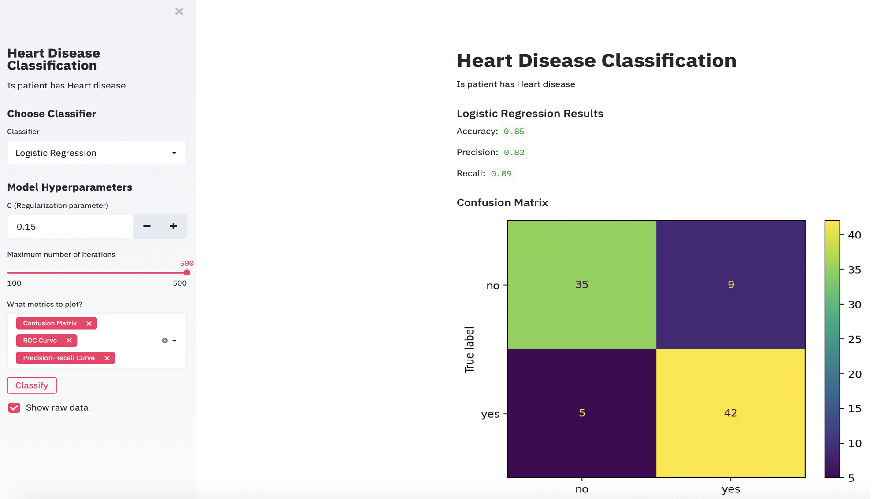
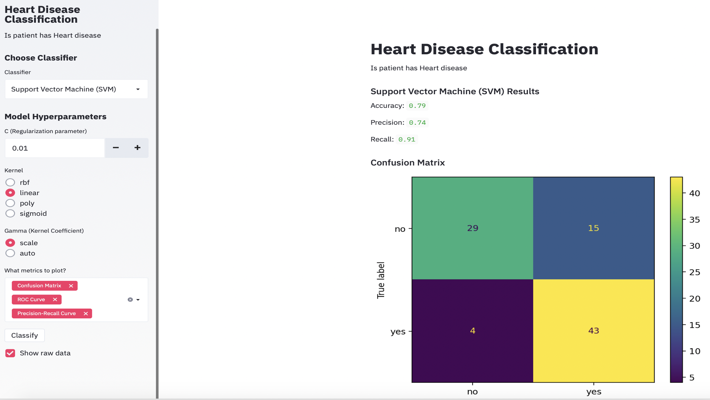
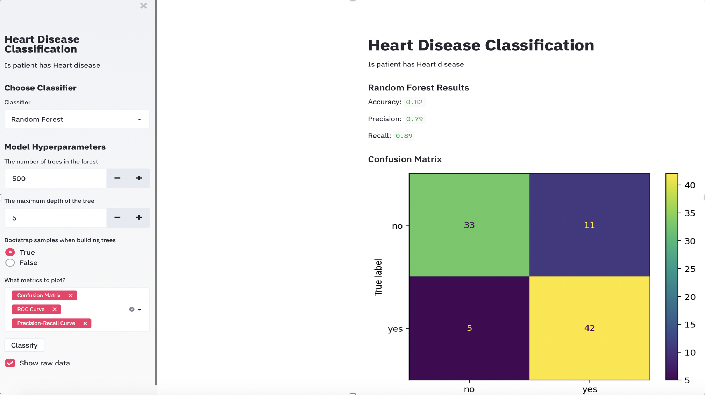

# Heart Disease Data Set
Analysis of [`Heart Disease Data Set`](https://www.kaggle.com/ronitf/heart-disease-uci) on web using [scikit-learn](https://scikit-learn.org/stable/) and [Streamlit](https://www.streamlit.io).

`Playing with the Heart Disease Data Set on the web using Stremlit...`

I have just used `Logistic Regression`, `SVM` and `Random Forest`. Futhermore, I have plotted `Confusion Matrix`, `ROC Curve` and `Precision-recall Curve`. You can play with other algorithms too.

I have given the option to manually fine tune few parameters such as `The number of trees in the forest` and `The maximum depth of the tree` in case of `Random Forest`. While, for `Logistic Regression` I gave the option of `Regularization parameter` and `Maximum number of iterations` and for `SVM`, I tried to fine tune `Regularization parameter` and `Kernel`. Play with these parameters to see which one work best for your dataset.

## Look at few of the sample Images:

